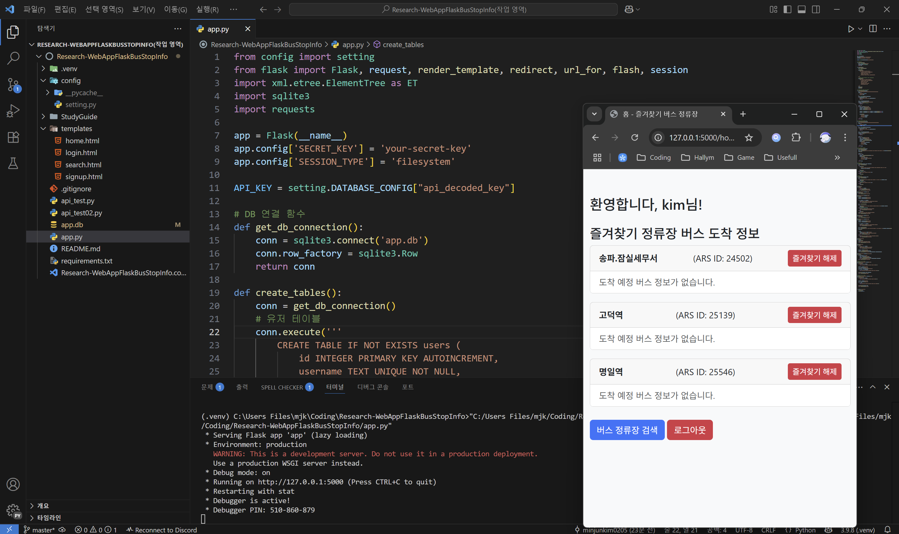

# 💻 Research-WebAppFlaskBusStopInfo

## Preview



- ## Introduction

    > Flask, jinja, json 으로 간단한 버스 도착 정보 웹앱 만들기

- ## Requirements  

    > Python version : 3.9.8

    ```cmd
    pip install -r requirements.txt
    ```

- ## Note

    > [StudyGuide](./StudyGuide/StudyGuide.md)
    > pip freeze > requirements.txt
